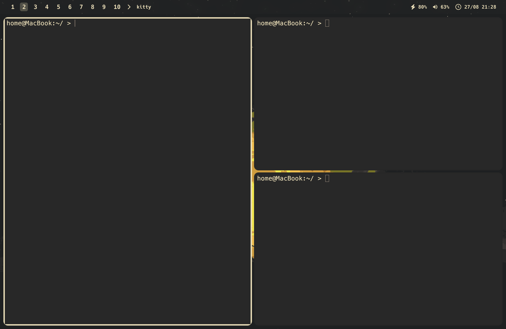

# myMac
My mac system setup.



## Setup commands
1. Use non-identifying hostname:
```
sudo scutil --set ComputerName MacBook; sudo scutil --set LocalHostName MacBook
```
2. Install Rosetta:
```
softwareupdate --install-rosetta
```
3. Install Xcode Command Line Tools:
```
xcode-select --install
```
4. Install [Homebrew](https://brew.sh/):
```
/bin/bash -c "$(curl -fsSL https://raw.githubusercontent.com/Homebrew/install/HEAD/install.sh)"
```
5. Stop dock from appearing (useful for window managers):
```
defaults write com.apple.dock autohide-delay -int 16; killall Dock
```
6. Enable FileVault:
```
sudo fdesetup enable
```

## [nix-darwin](https://github.com/nix-darwin/nix-darwin) setup (advanced):
1. Install [Lix](https://lix.systems/):
```
curl -sSf -L https://install.lix.systems/lix | sh -s -- install
```
2. Create flake.nix file:
```
sudo mkdir -p /etc/nix-darwin
sudo chown $(id -nu):$(id -ng) /etc/nix-darwin
cd /etc/nix-darwin
nix flake init -t nix-darwin/master
sed -i '' "s/simple/$(scutil --get LocalHostName)/" flake.nix
```
3. Install nix-darwin:
```
sudo nix run nix-darwin/master#darwin-rebuild -- switch
```
4. Using nix-darwin:
After installing, you can run `darwin-rebuild` to apply changes to your system:
```
sudo darwin-rebuild switch
```

## Installing packages
If you chose to download nix-darwin, use it to download your homebrew packages, if you chose not to, just use homebrew to install your homebrew packages. Although I do highly recommend using nix-darwin to declaratively install your nix & homebrew packages in you flake.nix file. This is because you can later use this file on a new system, or on your same system if you factory reset it to setup your system with all it's packages & settings faster.

This is a list of packages that improve my macbook experience, and will likely improve yours as well.

1. [yabai](https://github.com/koekeishiya/yabai):
 A tiling window manager for macOS. Best used with skhd.
2. [skhd](https://github.com/koekeishiya/skhd):
A Simple hotkey daemon for macOS. Best used with yabai. 
3. [SketchyBar](https://github.com/FelixKratz/SketchyBar):
A highly customizable macOS status bar replacement.
4. [JankyBorders](https://github.com/FelixKratz/JankyBorders):
A lightweight window border system for macOS.
5. [Albert](https://github.com/albertlauncher/albert):
A fast and flexible keyboard launcher.
6. [batt](https://github.com/charlie0129/batt):
Control and limit battery charging on Apple Silicon MacBooks.
7. [LuLu](https://github.com/objective-see/LuLu):
A free and open-source macos outgoing firewall.
8. [noTunes](https://github.com/tombonez/noTunes):
A simple macOS application that will prevent iTunes or Apple Music from launching.
9. [neovim](https://github.com/neovim/neovim):
A vim-fork focused on extensibility and usability.
10. [Mullvad Browser](https://github.com/mullvad/mullvad-browser):
A privacy-focused browser.
11. [Mullvad VPN](https://github.com/mullvad/mullvadvpn-app):
A private, paid VPN provider.
12. [exiftool](https://github.com/exiftool/exiftool):
A tool to view/edit/remove metadata.
13. [pass](https://www.passwordstore.org/):
A secure, local password manager that follows the unix philosophy.
14. [pass-top](https://github.com/tadfisher/pass-otp):
A pass extension for managing one-time-password (OTP) tokens.
15. [paperkey](https://github.com/dmshaw/paperkey/):
A tool to print a OpenPGP key on paper for archive and recovery.
16. [stow](https://www.gnu.org/software/stow/):
A symlink farm manager.
17. [yt-dlp](https://github.com/yt-dlp/yt-dlp):
A feature-rich command-line audio/video downloader.
18. [veracrypt](https://github.com/veracrypt/VeraCrypt):
A disk encryption tool with strong security based on TrueCrypt.
19. [linearmouse](https://github.com/linearmouse/linearmouse):
A mouse and trackpad utility for Mac.
